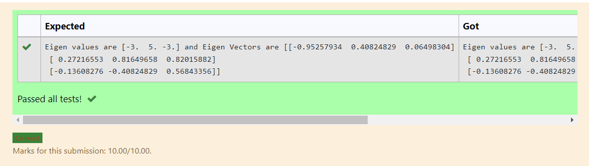

# EIGENVALUES-AND-EIGENVECTORS
## Aim:
To write a python program to find the Eigenvalues and Eigen Vectors
## Equipment’s required:
1. 	Hardware – PCs
2. 	Anaconda – Python 3.7 Installation / Moodle-Code Runner
## Algorithm:
### Step1 : 
import the numpy module to use the builtin function for calculation
### Step 2: 
prepare the lists fromm each linear equation and assign in np.array().

### Step 3: Using the np.linalg.eig(),  we get two results (first is eigenvalue and second is eigenvector) of the given matrix.

### Step 4: 
end the changes

## Program:
~~~
#Program to find the eigen values and eigen vectors.
#Developed by:Dhanush.S 
#RegisterNumber:21004324
import numpy as np
a = np.array([[-2,2,-3],[2,1,-6],[-1,-2,0]])
values,vectors=np.linalg.eig(a)
print("Eigen values are",values,"and Eigen Vectors are",vectors)

~~~

## Output:

## Result:
Thus the Eigenvalue and Eigenvector is successfully solved using python program.
